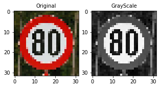

# **Traffic Sign Recognition** 

## Writeup

### You can use this file as a template for your writeup if you want to submit it as a markdown file, but feel free to use some other method and submit a pdf if you prefer.

---

**Build a Traffic Sign Recognition Project**

**SECTION DONE**

The goals / steps of this project are the following:
* Load the data set (see below for links to the project data set)
* Explore, summarize and visualize the data set
* Design, train and test a model architecture
* Use the model to make predictions on new images
* Analyze the softmax probabilities of the new images
* Summarize the results with a written report

[//]: # (Image References)

[image1]: ./examples/visualization.jpg "Visualization"
[image2]: ./examples/grayscale.jpg "Grayscaling"
[image3]: ./examples/random_noise.jpg "Random Noise"
[image4]: ./examples/placeholder.png "Traffic Sign 1"
[image5]: ./examples/placeholder.png "Traffic Sign 2"
[image6]: ./examples/placeholder.png "Traffic Sign 3"
[image7]: ./examples/placeholder.png "Traffic Sign 4"
[image8]: ./examples/placeholder.png "Traffic Sign 5"

## Rubric Points
### Here I will consider the [rubric points](https://review.udacity.com/#!/rubrics/481/view) individually and describe how I addressed each point in my implementation.  

---
### Writeup / README

#### 1. Provide a Writeup / README that includes all the rubric points and how you addressed each one. You can submit your writeup as markdown or pdf. You can use this template as a guide for writing the report. The submission includes the project code.

You're reading it! and here is a link to my [project code](https://github.com/udacity/CarND-Traffic-Sign-Classifier-Project/blob/master/Traffic_Sign_Classifier.ipynb)

### Data Set Summary & Exploration

#### 1. Basic summary of the data set. 

**SECTION DONE**

I used the pandas library to calculate summary statistics of the traffic
signs data set:

* The size of training set is 34799
* The size of the validation set is 4410
* The size of test set is 12630
* The shape of a traffic sign image is (32, 32, 3)
* The number of unique classes/labels in the data set is 43

#### 2. Exploratory visualization of the dataset.

**SECTION DONE**

Let's look how the data looks like
The below plot shows randomimages for each class

Here is an exploratory visualization of the data set. It is a bar chart showing how the data is distributed

### Design and Test a Model Architecture

**SECTION DONE**

As a first step, I decided to convert the images to grayscale because usually 
convolutions may capture patterns better from one channel data (reduce noise from the RGB data)

Here is an example of a traffic sign image before and after grayscaling.

As a next step, I normalized the image data because normalization is an important step which ensures that each input parameter (pixel, in this case) has a similar data distribution. This makes convergence faster while training the network.

I decided to generate additional data because original images may not capture all the patterns and I wanted the model generalize better . To consider various situations I have converted images in the following way: 

-  Rotated images by various angles (+- 20 degrees). Camera can see the images from various angles.
-  Model should be robust with various brightness levels 
-  Translations - models traffic signs at different positions on the picture
-  Applied affine transformations. Affine Transformation helps to modify the geometric structure of the image, preserving parallelism of lines, but not the lengths and angles. It preserves collinearity and ratios of distances.

I have applied combinations of all these techniques to the same image during the augmantation process using random factor

This means that to some of the images for instance i have applied brightness transformation and then affine_transformation.
For other images i could apply other sequences of trnasformations. 
Images which were selected for certain tranformations sequences are defined by random factor

We have imbalanced dataset. it means that classes are not equaly distributed

To fix this i have developed several methods:

- Add images to complete number of images of certain class to the certain level (N_Images) 

Here are possible combinations augmented images.

Images Rotation

Brightness

TRanslation

Affine transformation

#### 2. Final model architecture (model type, layers, layer sizes, connectivity, etc.) 

My final model consisted of the following layers:

| Layer         		|     Description	        									| 
|:---------------------:|:--------------------------------------------------------------| 
| Input         		| Input = 32x32x1 grayscale image  								|
| Convolution 5x5     	| 1x1 stride, same padding, Output = 28x28x6. grayscale image	|
| RELU                  | 																|
| Max Pooling        	| 2x2 stride,  outputs 14x14x6 									|
| Convolution 5x5    	| 1x1 stride, same padding, Output = 10x10x16					|
| RELU                  | 																|
| Max Pooling        	| 2x2 stride,  outputs 5x5x16 									|
| Fully connected		| Input = 400. Output = 120. 									|
| RELU                  | 																|
| Fully connected		| Input = 120. Output = 184. 									|
| RELU                  | 																|
| Fully connected		| Input = 84. Output = 10. 										|
|						|																|

#### 3. Model traning process.(the type of optimizer, the batch size, number of epochs and any hyperparameters such as learning rate)

To train the model, I used the following parameters:

- EPOCHS = 150. Have tried various number of epochs. larger number of epochs do not give any improvement in the quality of the model.
- BATCH_SIZE = 128
- rate = 0.01/0.001. Have applied dynamic learning metric (larger on the initial stages and lower on the later stages of the learning process)
- mean(cross_entropy) as the metric which shoud be optimized.
- Adam as an optimizer

#### 4. Description of the approach taken for finding a solution and getting the validation set accuracy to be at least 0.93. Include in the discussion the results on the training, validation and test sets and where in the code these were calculated. Your approach may have been an iterative process, in which case, outline the steps you took to get to the final solution and why you chose those steps. Perhaps your solution involved an already well known implementation or architecture. In this case, discuss why you think the architecture is suitable for the current problem.

My final model results were:
**TODO**
* training set accuracy of 1.00 
* validation set accuracy 0.951
* test set accuracy of 0.933

**DONE**
If an iterative approach was chosen:
* What was the first architecture that was tried and why was it chosen?

I have used LeNet() arcitecture from the very beginning.
Haven't changed the arcitecture of the a model too much.
Mainly was focused on hyperparameters tunning (num epochs,batch size etc.)

* What were some problems with the initial architecture?
* How was the architecture adjusted and why was it adjusted? Typical adjustments could include choosing a different model architecture, adding or taking away layers (pooling, dropout, convolution, etc), using an activation function or changing the activation function. One common justification for adjusting an architecture would be due to overfitting or underfitting. A high accuracy on the training set but low accuracy on the validation set indicates over fitting; a low accuracy on both sets indicates under fitting.

* Which parameters were tuned? How were they adjusted and why?

- Number of epochs has been changed from 128 to 256. Finally has stopped with batch size 128 as was getting the higher performance.

I have tried to play with the input data and build the model on the various sets 

- tried to train on augmented balanced data (applied all transoframtions randomly which has been described above)
  grayscale and normalization has been applied.
- has randomly chosen original images from abalanced data set and dataset with original images plus augmented dataset
- original data transformed to grayscale and normalized

Finally I have got the best performance on the original dataset with data transformaed to grayscale and normalized

* What are some of the important design choices and why were they chosen? For example, why might a convolution layer work well with this problem? How might a dropout layer help with creating a successful model?

If a well known architecture was chosen:
* What architecture was chosen? LeNet

I have tried LeNet architecture as it has been used for similar problems before (for classification problems in particular)
I have got quite good results on the validation and test sets as can be seen above.

* Why did you believe it would be relevant to the traffic sign application?
* How does the final model's accuracy on the training, validation and test set provide evidence that the model is working well?
 

### Test a Model on New Images

#### 1. Choose five German traffic signs found on the web and provide them in the report. For each image, discuss what quality or qualities might be difficult to classify.

Here are five German traffic signs that I found on the web:

The first image might be difficult to classify because ...

#### 2. Discuss the model's predictions on these new traffic signs and compare the results to predicting on the test set. At a minimum, discuss what the predictions were, the accuracy on these new predictions, and compare the accuracy to the accuracy on the test set (OPTIONAL: Discuss the results in more detail as described in the "Stand Out Suggestions" part of the rubric).

Here are the results of the prediction:

| Image			          |     Prediction	        					| 
|:---------------------:  |:---------------------------------------------:| 
| Speed limit (50km/h)-2  | Speed limit (30km/h)-1   						| 
| Go straight or left-37  | Go straight or left-37 							|
| Stop-14		          | Yield-13										|
| Ahead only-35			  | Ahead only-35					 				|
| Speed limit (80km/h)-5  | Speed limit (30km/h)   							|

The model was able to correctly guess 2 of the 5 traffic signs, which gives an accuracy of 40%. 
This is not perfectly comapred with the accuracy on the test set.
Seems model has not captures certain patters and this is the potential for improvement.

#### 3. Describe how certain the model is when predicting on each of the five new images by looking at the softmax probabilities for each prediction. Provide the top 5 softmax probabilities for each image along with the sign type of each probability. (OPTIONAL: as described in the "Stand Out Suggestions" part of the rubric, visualizations can also be provided such as bar charts)

The most probabale class predictions are reflected below 

### (Optional) Visualizing the Neural Network (See Step 4 of the Ipython notebook for more details)
#### 1. Discuss the visual output of your trained network's feature maps. What characteristics did the neural network use to make classifications?

